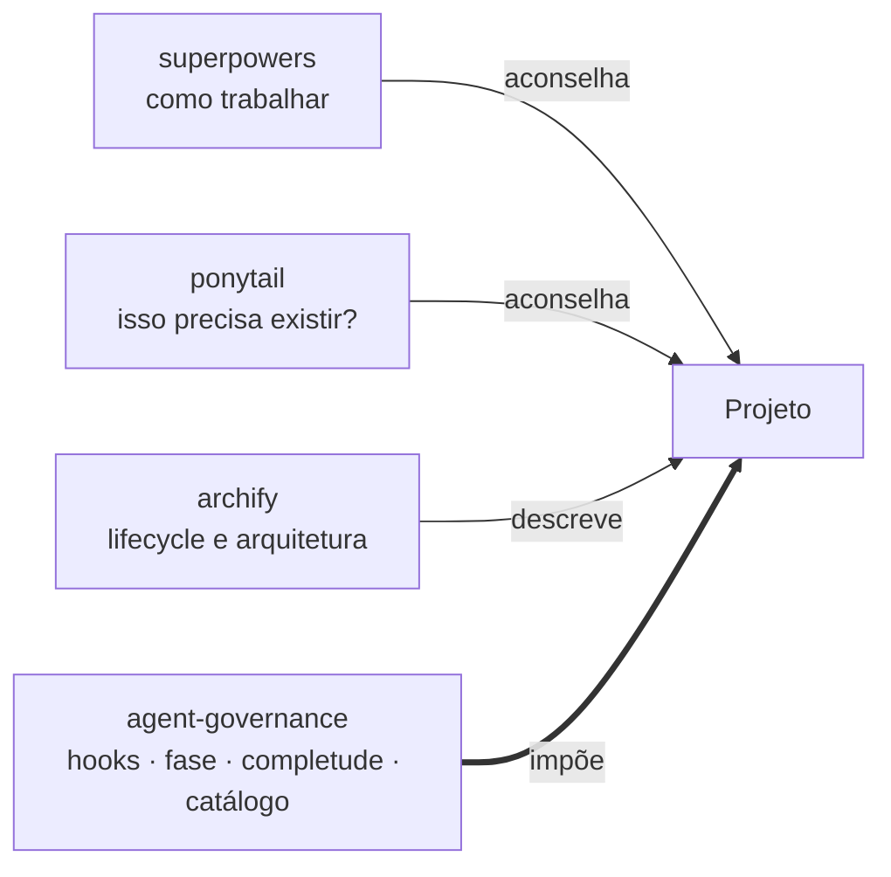
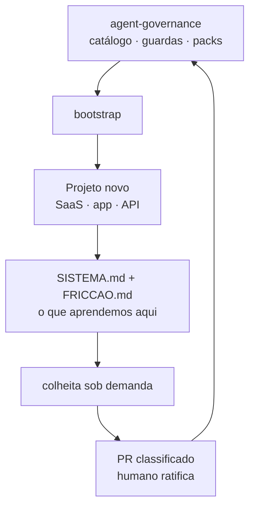
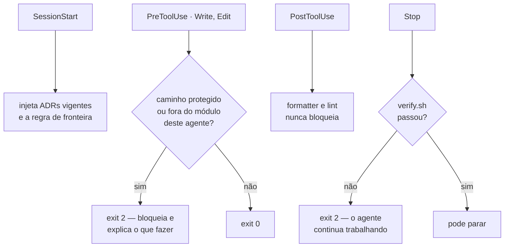
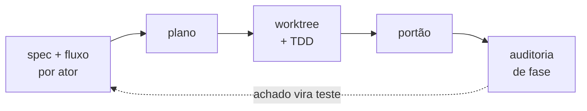

# agent-governance

**Camada de imposição para desenvolvimento assistido por agentes.** Instalada
num projeto novo, ela faz o time começar preparado — e faz o projeto seguinte
começar melhor que este.

> Marcas temporais em uso neste repositório: `[HOJE]` existe e funciona ·
> `[PROPOSTO]` decidido, não implementado · `[NÃO EXISTE]` identificado como
> necessário, sem decisão · `[VERIFICAR]` precisa ser confirmado antes do uso.
> Afirmação sem marca descreve o problema, não a ferramenta.

---

## O problema

Desenvolvimento com agentes falha por três motivos, nesta ordem de frequência:

**1. Regra escrita em markdown é conselho, não lei.**
Um agente instruído a não editar a especificação edita a especificação quando
isso resolve o problema dele. O resultado fica internamente coerente e
completamente errado, e a evidência da divergência some junto.

**2. A definição de pronto é o resumo do agente.**
Sem oráculo externo, "terminei" significa "acho que terminei". Este próprio
repositório sofreu disso: o CHANGELOG registrou marketplace e CI como fato
consumado quando nenhum dos dois estava commitado.

**3. Teste não responde "falta?".**
Teste é fechado sobre o código: verifica que o que existe funciona, e é
logicamente incapaz de verificar que algo **deveria** existir. Um método sem
caminho de volta, um campo que nenhuma tela altera, um estado sem transição de
saída — nada disso quebra nada.

---

## O objetivo

Hoje toda correção que você faz num agente morre no chat. Projeto novo começa do
zero, os mesmos defeitos são redescobertos, os mesmos portões reescritos, e o
nível de qualidade é função de quanto alguém lembrou de exigir naquele dia.

**Este repositório existe para que uma correção feita uma vez nunca precise ser
feita de novo.**

É uma catraca: só anda para frente, e o nível de partida do projeto N+1 é o
nível de chegada do projeto N.

### Tese central

Agente é competente e não confiável **individualmente**. Logo, a garantia não
pode vir do agente. Vem de fora dele: hook que impõe, oráculo que verifica,
artefato que registra.

Corolário operacional, que atravessa todas as decisões deste repo:
**toda regra que puder ser imposta por mecanismo não deve ficar em markdown.**
Correção que mora em prosa é lida e esquecida; correção que vira hook ou teste
persiste porque não depende de leitura.

---

## O que este repo é — e o que não é

Existem hoje cinco pacotes de skills maduros e excelentes somando mais de 700
mil estrelas. Todos resolvem **disciplina**: spec, plano, TDD, code review,
ship. Reescrever isso seria exatamente a reconstrução que o objetivo proíbe.

Este repo **não** constrói disciplina. Ele constrói o que falta:



A regra que evita briga entre eles: **só a nossa camada bloqueia.** Terceiros
aconselham, archify descreve, bloqueio é hook, e hook é nosso.

| Construímos | Não construímos |
|---|---|
| propriedade por papel, imposta | TDD, code review, planos |
| definição de pronto imposta no `Stop` | worktrees, personas de QA |
| consciência de fase | design system, QA de navegador |
| auditoria de completude | orquestração de sprint |
| catálogo e colheita entre projetos | — |

Decisão registrada no [ADR 0012](docs/adr/0012-disciplina-de-terceiro.md).

---

## Como funciona: a catraca

Este repositório **não acompanha** os projetos. Ele os **inicia**. Um SaaS ou
app novo nasce em repo próprio, e o framework é instalado ali.



Duas classes de entrega, e a distinção é o núcleo do desenho:

- **Instalado, atualizável** — guardas, agentes, skills, packs. Genéricos,
  chegam por plugin com versão pinada pelo projeto.
- **Gerado, do projeto para sempre** — `PROJETO.md`, `ownership.json`,
  `verify.sh`, constitution, ADRs. Nascem do bootstrap e viram do sistema.

Em uma frase: **o time é instalado; a memória é gerada.**

A seta de volta é o que separa catraca de scaffold. Ida sem volta envelhece:
o projeto 4 nasceria com o que sabíamos em agosto. Detalhes no
[ADR 0013](docs/adr/0013-framework-como-ponto-de-partida.md).

---

## Os mecanismos

Toda a política é imposta por hooks, que rodam como processos reais do sistema
operacional, de forma determinística — não quando o modelo decide.



Três propriedades que fazem isso funcionar:

- **`PreToolUse` é o único bloqueio confiável.** Regras de permissão e
  `.claudeignore` podem ser contornadas por indexação e system reminders.
- **A mensagem de bloqueio explica o que fazer**, não só o que foi negado. O
  modelo lê esse texto e age sobre ele.
- **Degradação declarada.** Configuração ausente → passa com aviso.
  Configuração presente e malformada → bloqueia. Ausência é escolha legítima;
  malformação é defeito ([ADR 0007](docs/adr/0007-modo-de-degradacao.md)).

---

## Instalação

### Uma vez por máquina — ferramentas de disciplina

```sh
# superpowers — disciplina de desenvolvimento
/plugin install superpowers@claude-plugins-official
export SUPERPOWERS_DISABLE_TELEMETRY=1

# archify — lifecycle e arquitetura como IR tipado
npx skills add tt-a1i/archify -g

# ponytail — parecer de corte de código. Intensidade lite, always-on DESLIGADO
/plugin marketplace add DietrichGebert/ponytail   # [VERIFICAR] confirmar no repo
```

### Este repositório

```sh
/plugin marketplace add PedrodeAndradecf/agent-governance
/plugin install governance@agent-governance
```

`[VERIFICAR]` — o marketplace foi escrito mas ainda não passou por
`claude plugin validate`. Até lá, use cópia manual: os scripts de
`plugins/governance/hooks/` para `.claude/hooks/` do projeto, e o bloco de hooks
para `.claude/settings.json`. O formato é idêntico entre plugin e settings,
então migrar depois é mover o bloco.

---

## Ligar num projeto

### 1. Declarar o projeto

Copie `plugins/governance/templates/PROJETO.md` para a raiz e preencha.
**Nada funciona antes disso.**

| Campo | Decide |
|---|---|
| stack | qual pack, o que o `verify.sh` roda, quais regras ArchUnit |
| atores | quais fluxos a auditoria percorre |
| fases | o que é achado e o que é ausência esperada |
| perfil | quanto aparato de concorrência liga |
| fronteiras | quais portas de sentido único precisam de ADR antes do código |

Use `/brainstorming` do superpowers para preencher. Ele existe para extrair o
que você quer de fato, em vez do que você acha que quer.

### 2. Arquivos que o bootstrap escreve

```
.claude/ownership.json      mapa de propriedade
.claude/settings.json       a cadeia de hooks
scripts/verify.sh           definição de pronto executável
docs/adr/                   decisões de arquitetura
docs/SISTEMA.md             o que aprendemos construindo isto
docs/FRICCAO.md             o que não encaixou entre as ferramentas
specs/                      specs e fluxos por ator
lifecycle/                  IR do archify
```

### 3. O fluxo



**Fase 0, antes de qualquer código:** `PROJETO.md` ratificado, lifecycle no
archify escrito a partir da intenção, ADRs das fronteiras, constitution.

**Por fatia vertical:** spec aprovada → fluxo por ator escrito **antes** do
código e protegido contra o implementador → plano → worktree e TDD → portão
(`verify.sh` bloqueia, code review e ponytail aconselham).

**Fim de fase:** percorrer cada fluxo contra o código nas duas direções,
comparar com o lifecycle, classificar achados em veracidade e completude, e
**cada achado confirmado vira teste**.

---

## O time

| Papel | Lê | Escreve | Veta | Muda spec/ADR |
|---|---|---|---|---|
| Implementador | tudo | só seu módulo | não | **nunca** |
| Arquiteto | tudo | rascunho de ADR, `SISTEMA.md` | sim, em fronteira | propõe; humano ratifica |
| QA | tudo | apenas testes | sim, teste vermelho | não |
| Segurança | tudo | nada | sim, finding alto | não |
| Ponytail | só o diff | nada | não | não |

Duas invariantes: **quem escreve código não aprova código**, e o implementador
não tem permissão de escrita em `specs/` nem `docs/adr/`. Imposto por hook, não
por instrução.

**Saída do Arquiteto**, quatro vias: *spec estava errada* (emenda, humano
ratifica) · *implementação está errada* (volta ao implementador) · *spec certa,
custo alto* (registra dívida) · *contradição entre artefatos* (**requer
humano**).

---

## Catálogo de cenários

Falhas observadas, com o que fazer em cada uma. Entrada só entra depois de
observada pelo menos uma vez.

| ID | Cenário | Precisa de paralelismo? |
|---|---|---|
| C001 | Estado durável compartilhado fora do worktree | **sim** |
| C002 | Implementador ajusta a spec ao que construiu | não |
| C003 | Agente declara pronto o que não fez | não |
| C004 | Afirmação de fase futura escrita no presente | não |
| C005 | Estado alcançável sem transição | não |
| C006 | Código que nenhum fluxo alcança | não |

**Cinco dos seis existem com um agente só.** O valor está em completude e
veracidade de artefato, não em coordenação de concorrência — o que contraria a
intuição que originou o projeto e é o achado mais importante até agora.

Cada cenário se resolve por uma de quatro vias, em ordem crescente de custo:
**isolar > impedir > detectar > recuperar**.

→ [`docs/CATALOGO.md`](docs/CATALOGO.md)

---

## Perfis de adoção

| Perfil | Quando | Estado |
|---|---|---|
| **1 — Solo** | um agente por vez | `[HOJE]` cobre C002 a C006 |
| **2 — Paralelo leve** | um implementador, revisores read-only | `[BLOQUEADO]` falta destino durável do parecer |
| **3 — Paralelo pesado** | N sessões, uma por worktree | `[PROPOSTO]` identidade por worktree |

O perfil escolhe **quanto aparato de concorrência**, nunca quanta qualidade.
Comece no 1; suba quando um cenário do catálogo doer de verdade.

---

## Estado atual

Honestidade sobre o que está pronto é parte do produto — o C003 nasceu aqui
dentro.

### Funciona `[HOJE]`
Guarda de propriedade em `PreToolUse`, gate de `verify.sh` em `Stop`,
degradação aberta/fechada, agentes com ferramentas restritas. Dez cenários
validados — **com payload sintético**, chamando os scripts diretamente.

### Não validado
`claude plugin validate` nunca foi executado. Instalação em projeto vazio nunca
foi executada. O ramo que depende de identidade de agente nunca viu payload
real.

### Bloqueios, em ordem de custo
1. **Destino durável do parecer** — trava o perfil 2 e o protocolo dos papéis.
   Proposta pendente: comentário em PR.
2. **Camada de distribuição** — escrita, falta validar.
3. **Identidade do agente** — deixou de bloquear com um terminal por agente;
   falta confirmar contra payload real.

### `[NÃO EXISTE]`
ADRs 0009 a 0011 (fluxo por ator normativo, triagem temporal, marca temporal
obrigatória) · runbooks das ferramentas · comando de colheita · packs por stack.

---

## Documentação

| Documento | Para quê |
|---|---|
| [`docs/SINTESE.md`](docs/SINTESE.md) | contexto completo — comece aqui |
| [`docs/GUIA.md`](docs/GUIA.md) | instalação e fluxo operacional |
| [`docs/CATALOGO.md`](docs/CATALOGO.md) | cenários de falha e o que fazer |
| [`docs/adr/`](docs/adr/) | as decisões e por quê |
| [`docs/VERIFICACAO.md`](docs/VERIFICACAO.md) | o que foi testado e o que não foi |

---

## Licença

`[NÃO EXISTE]` — a decidir.
